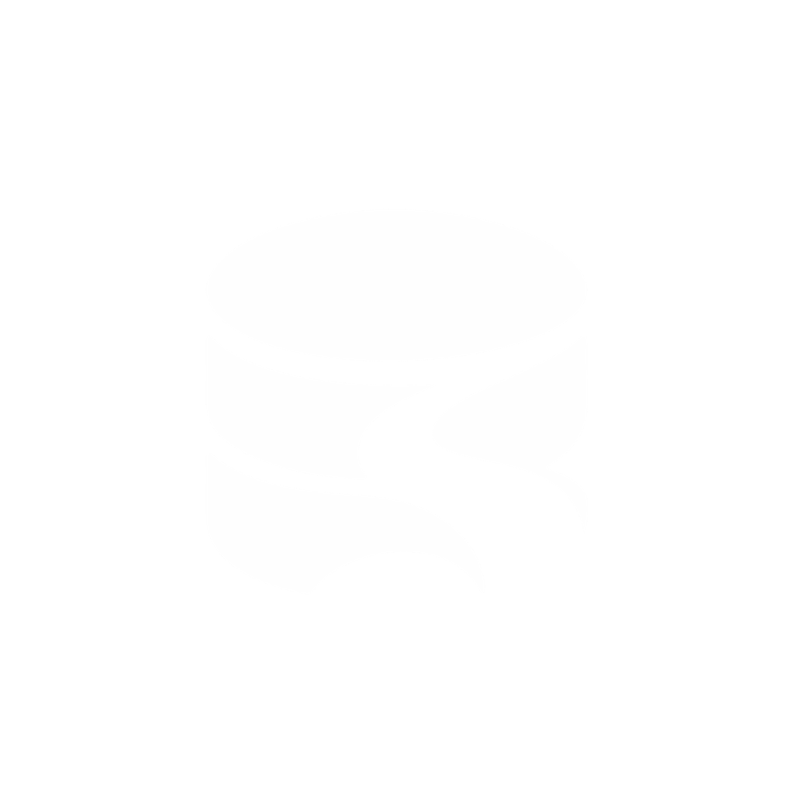

<p align="center">
  
</p>

# Dalan

[](https://github.com/yan-ad/dalan/actions/workflows/ci.yml)


## Introduction

Dalan means “ways” in Javanese. It is a native Rust + GPUI Kit database workspace with DataGrip-inspired workflows, compact layout, Kit standard controls and Kit's default theme.

MySQL and MariaDB are experimental: source management, offline schema browsing, table tabs, WHERE/ORDER BY, restricted read-only query consoles, and loaded CSV export are implemented. PostgreSQL, Redis, plugins, and live ACP-only AI integration are planned. No application BYOK or general-purpose IDE tools.

Appearance defaults to OS-following **System**, cycling System → Light → Dark with a saved `dalan.config` preference and Kit default colors. Passwords are session-only unless **SaveForever** explicitly saves them as local unencrypted plaintext in `dalan.auth`; Keychain saving is removed. See [security and storage boundaries](docs/security.md#credentials-and-persistence).

## Installation

Requires macOS, Rust/rustup, Python 3, and Xcode Command Line Tools. Build and open the local debug app:

```sh
git clone https://github.com/yan-ad/dalan.git
cd dalan
./scripts/macos --open
```

Output: `target/debug/bundles/Dalan.app`. This is a local ad-hoc signed build, not a notarized installer. It uses the supplied PNG/icns icon fallback by default; optional Icon Composer compilation requires full Xcode. [Build and icon details](docs/development.md).

## Development

Optionally install `cargo install bacon --version 3.26.0 --locked`, then run `bacon` for native macOS rebuild-and-restart preview (not hot reload).
See [Bacon setup and restart caveats](docs/development.md#bacon-live-preview); `bacon check`/`test`/`lint` run headless jobs.

```sh
cargo fmt --all --check
cargo test --workspace --locked
cargo clippy --workspace --all-targets --locked -- -D warnings
./scripts/macos --run
```

The pinned toolchain is installed by rustup. Headless tests run on macOS, Linux, and Windows; desktop support is macOS-first. See [development setup](docs/development.md) and [test strategy](docs/testing.md) for UI, database fixture, and release commands.

## Contribution

Implement one tested database workflow at a time. Preserve credential safety, lossless values, bounded results, and ACP-only AI. Read [CONTRIBUTING.md](CONTRIBUTING.md) and [ROADMAP.md](ROADMAP.md) before changing architecture or scope.

## Reference

- [Roadmap](ROADMAP.md): drivers, plugins, and ACP AI, now through future.
- [Source management](docs/source-management.md), [table browser](docs/table-browser.md), and [query consoles](docs/query-consoles.md).
- [Architecture](docs/architecture.md), [security](docs/security.md), and [feature checklist](docs/feature-checklist.md).
- [DBX reuse assessment](docs/dbx-reuse.md), [staged DBX toolbar parity](docs/dbx-toolbar-parity.md), and [design direction](DESIGN.md).

## License

Dalan's project and supplied artwork licenses have not yet been selected; no open-source redistribution grant is implied. Third-party assets and adapted code retain their own licenses in [THIRD_PARTY_NOTICES.md](THIRD_PARTY_NOTICES.md). Resolve project/artwork licensing before public distribution.
